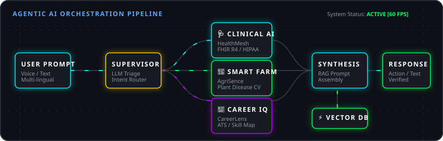
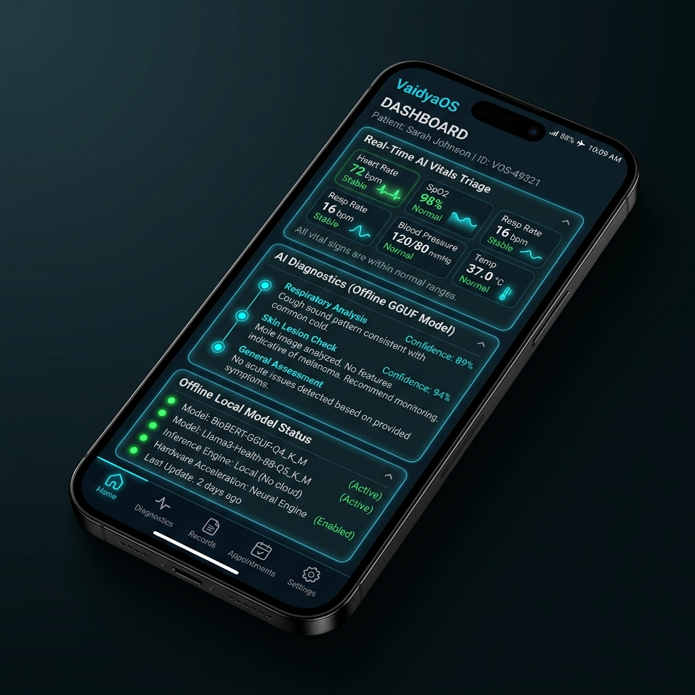
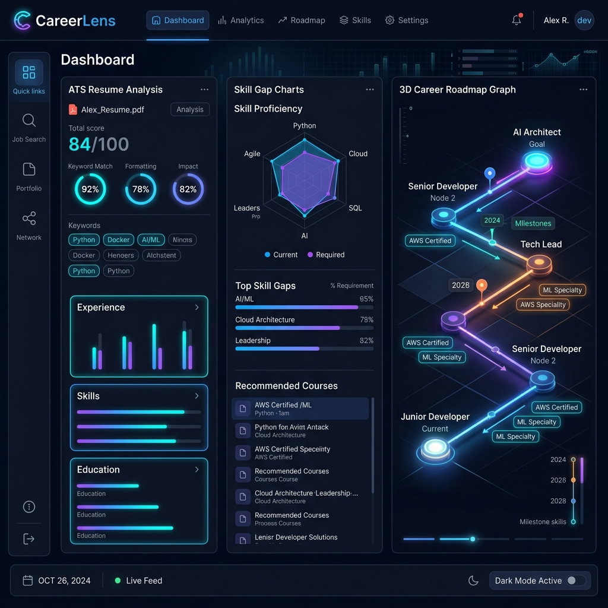
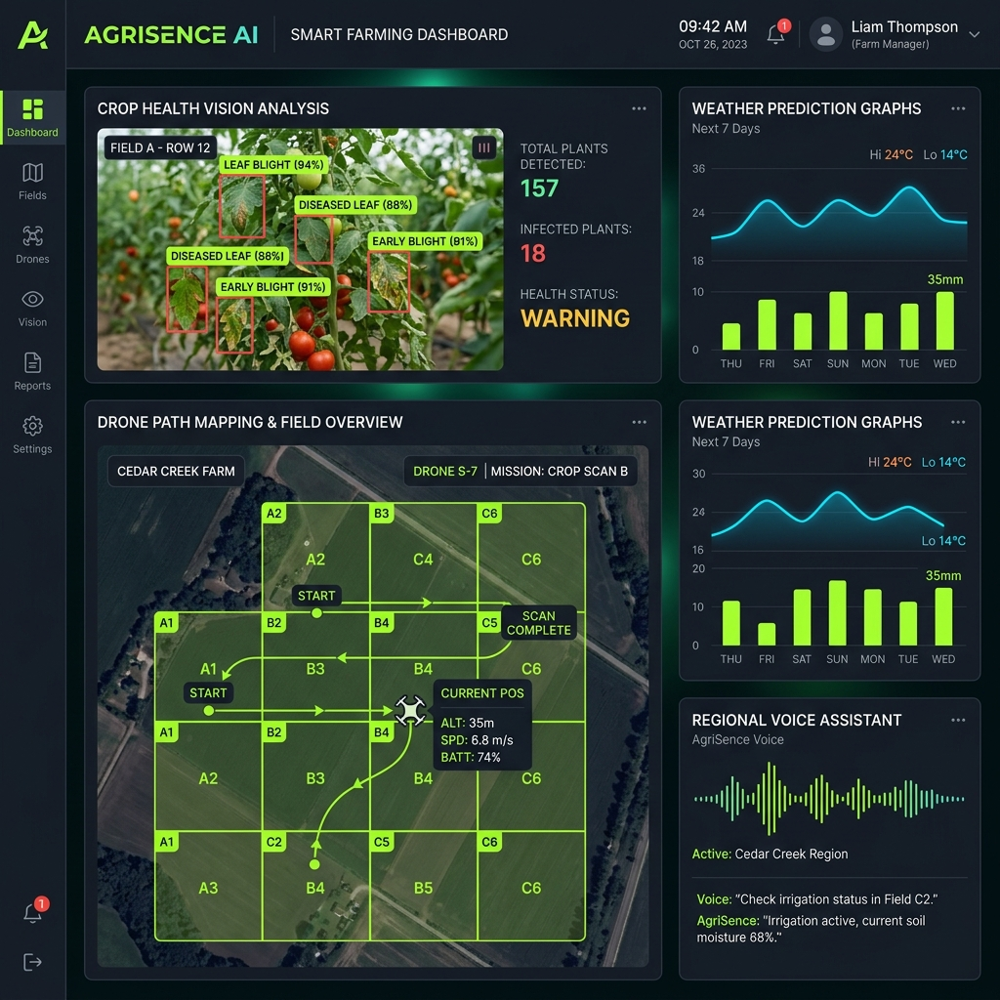
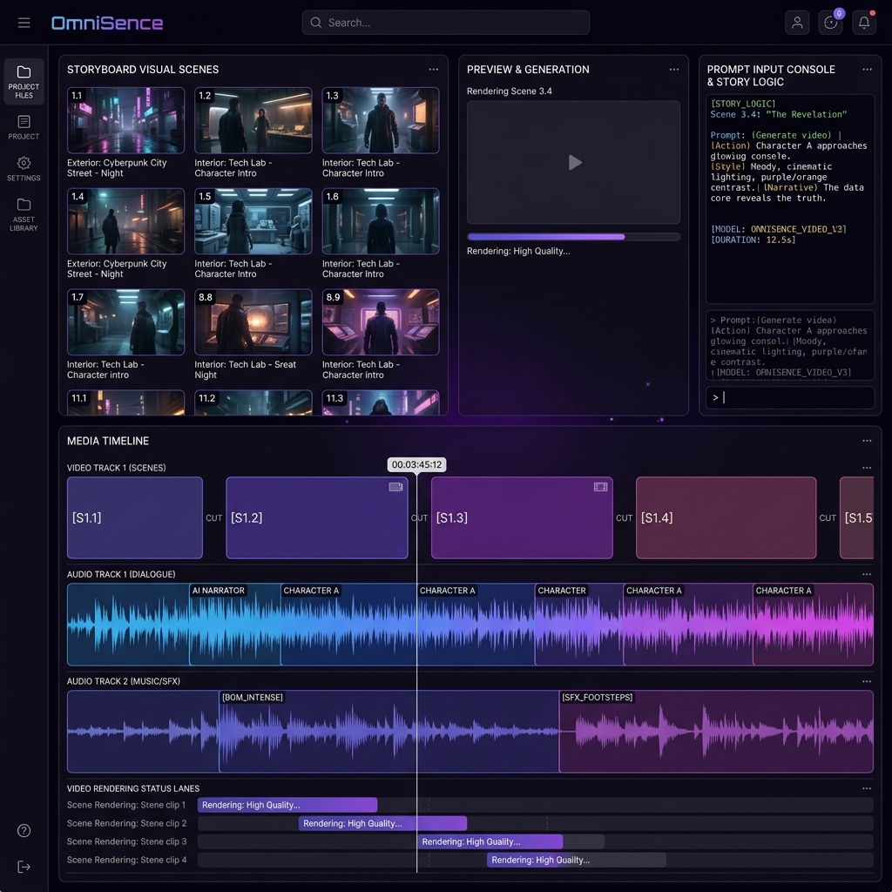
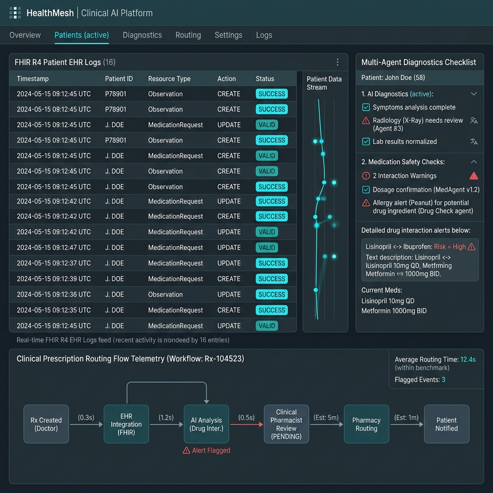
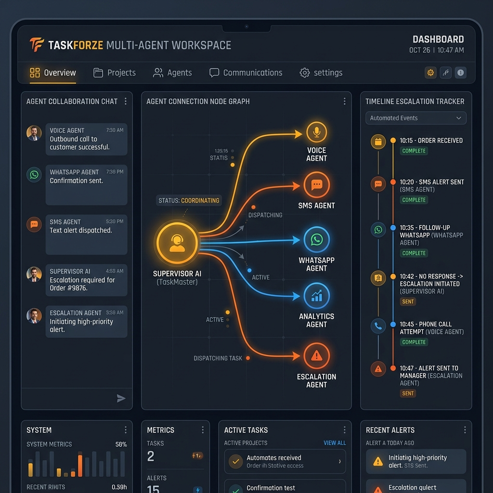
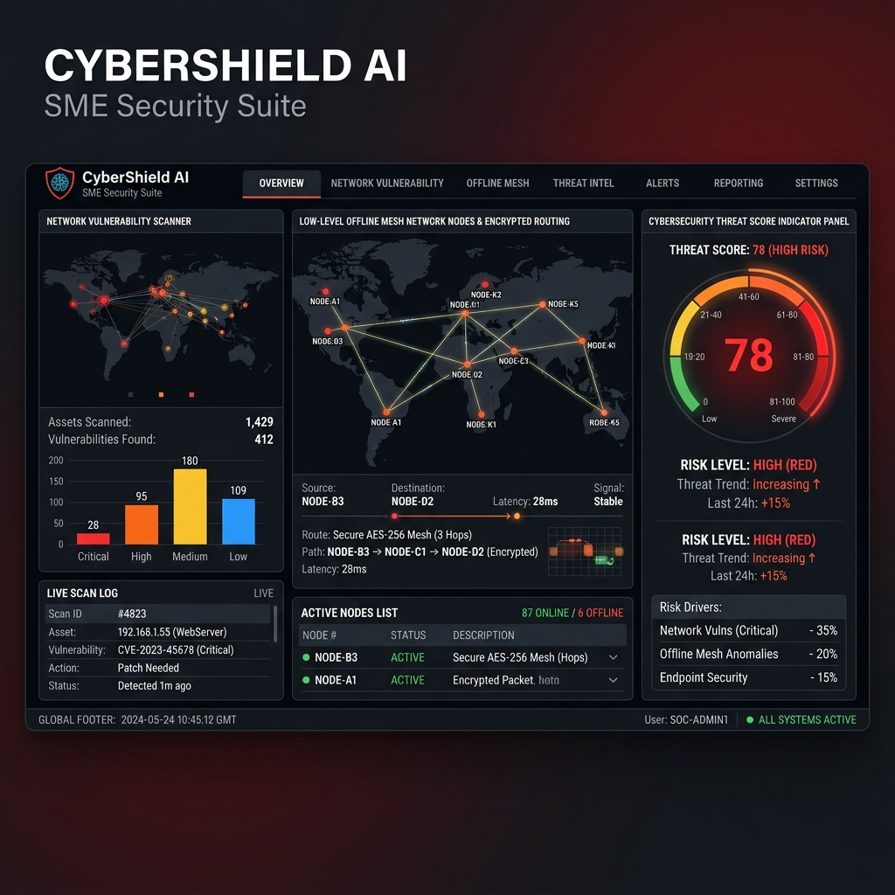

<div align="center">

<!-- Hero Banner -->


<!-- Animated typing -->
<a href="https://git.io/typing-svg">
  
</a>

<br/><br/>

<!-- Impact at-a-glance -->
<table>
<tr>
<td align="center" width="20%">
<br/>
<b>Competed</b>
</td>
<td align="center" width="20%">
<br/>
<b>Top Honours</b>
</td>
<td align="center" width="20%">
<br/>
<b>Prize Money</b>
</td>
<td align="center" width="20%">
<br/>
<b>Shipped</b>
</td>
<td align="center" width="20%">
<br/>
<b>Credentials</b>
</td>
</tr>
</table>

<br/>

<!-- Social Links — Single Row -->
<p>
  <a href="https://balaraj.vercel.app"></a>
  <a href="mailto:balarajr483@gmail.com"></a>
  <a href="https://www.linkedin.com/in/balaraj-r-209a67330"></a>
</p>
<p>
  <a href="https://www.kaggle.com/balarajr"></a>
  <a href="https://huggingface.co/balarajr"></a>
  <a href="https://g.dev/balarajr"></a>
  <a href="https://x.com/Balaraj__r"></a>
  <a href="https://www.skills.google/public_profiles/7e29917e-8bd6-41e6-8149-0795ae63c97b"></a>
</p>
<p>
  
  
  
</p>

<!-- Agent Pipeline SVG -->
<p align="center">
  
</p>

</div>

---

## 👨‍💻 About Me

```python
class BalarajR:
    role       = "AI/ML Engineer | Full Stack Developer | Intelligent Systems Builder"
    location   = "Bengaluru, Karnataka, India 🇮🇳"
    education  = "PES University — B.Tech CSE (AI & ML), 2024–2028"
    contact    = "balarajr483@gmail.com | balaraj.vercel.app"

    domains = [
        "Agentic AI & Multi-Agent Orchestration",
        "Healthcare AI — HIPAA-aware, FHIR R4-compliant systems",
        "Agricultural AI & Smart Farming (rural India scale)",
        "Edge AI — On-device inference with quantized LLMs",
        "Cloud-Native Full Stack (GCP · Azure · Firebase)",
    ]

    building = {
        "VaidyaOS"   : "Offline-first Edge AI healthcare OS — runs LLMs on rural Android devices",
        "CareerLens" : "AI career intelligence — Google Gen AI Exchange National Winner 🏆",
        "AgriSence"  : "AI smart farming platform — Inferentia 2.0 State Winner 🥇",
        "HealthMesh" : "HIPAA-ready multi-agent clinical AI — Microsoft Imagine Cup",
    }

    mission = "Build ethical, explainable AI that empowers humans in critical decisions."
    values  = ["Offline-first", "Privacy by design", "Real-world impact", "Ship fast"]
```

---

## ⚡ Current Focus

> What I'm actively shipping right now — updated regularly.

| 🔨 Project | 📍 Status | 🎯 Next Milestone |
|---|---|---|
| **VaidyaOS** — Edge AI Healthcare OS | 🟢 Active | Multilingual symptom parser v2, Gemma 3 GGUF upgrade |
| **AgriSence** — AI Smart Farming | 🟢 Active | NDVI satellite feed integration, 7-language voice expansion |
| **HealthMesh v2** — Clinical AI | 🟡 Iterating | FHIR R4 audit log compliance, 2 new agent specializations |
| **OSS Contributions** | 🔵 Starting | Genkit docs, LangChain JS examples, Firebase SDK |
| **Edge AI Research** | 🔵 Exploring | Quantization benchmarks: Gemma 2B vs Phi-3 Mini on Android |

---

## 🏆 Achievements

<div align="center">

| 🥇 Award | 🏛️ Organiser | 📅 |
|---|---|---|
| 🏆 **National Winner** — Google Gen AI Exchange Hackathon | Google Cloud × Hack2skill | 2025 |
| 🥇 **1st Place** — Inferentia 2.0 State Hackathon | PES University · AURA · AI&ML Dept | Sep 2025 |
| 🚀 **Round 1 Finalist** — Meta PyTorch OpenEnv Hackathon | Meta × OpenEnv × Scaler | Apr 2026 |
| 🌟 **Google APAC Finalist** — Gen AI Academy APAC | Google Cloud × Hack2skill | 2026 |
| 🛡️ **AMD Slingshot Hackathon** — CyberShield AI | AMD | 2025 |

</div>

---

## 🚀 Flagship Projects

### 🩺 VaidyaOS — Edge AI Healthcare Operating System
<div align="center">

[](https://github.com/balaraj74/VaidyaOS)
[](https://roaring-valkyrie-042963.netlify.app/VaidyaOS.apk)


<br/>


</div>

**Problem**: 65% of India's rural population lacks access to qualified doctors. Internet connectivity is intermittent. Clinical AI must work *without* the cloud.

VaidyaOS is an offline-first Edge AI operating system for healthcare accessibility. It runs quantized LLMs directly on Android devices — enabling clinical triage, symptom analysis, and multilingual medical guidance with zero internet dependency.

| Feature | Implementation |
|---|---|
| 🧠 On-Device AI Inference | Llama.cpp + Gemma 2B GGUF (Q4_K_M quantization) |
| 📱 Cross-Platform Mobile | React Native — Android + iOS from single codebase |
| 🔥 Hybrid Sync | Firebase for online sync, AsyncStorage for offline caching |
| 🗣️ Multilingual | Kannada, Hindi, Tamil, Telugu, Malayalam clinical translation |
| 🔒 Privacy-First | All inference runs locally — no patient data leaves the device |

**Stack**: `React Native` · `Gemma` · `Llama.cpp` · `Firebase` · `Python` · `FastAPI`

---

### 🎯 CareerLens — AI Career Intelligence Platform
<div align="center">

[](https://github.com/balaraj74/careerlens)
[](https://careerlens--careerlens-1.us-central1.hosted.app)
[](https://careerlens--careerlens-1.us-central1.hosted.app)


<br/>


</div>

**Problem**: Job seekers apply blindly — no feedback on why they're rejected by ATS systems or how to close their skill gaps fast.

CareerLens is an event-driven AI career platform that automates resume parsing, identifies ATS failures, and generates personalized upskilling roadmaps aligned to live job market demand. Selected as the **National Winner** of the Google Gen AI Exchange Hackathon.

| Feature | Implementation |
|---|---|
| 🎯 ATS Optimization | Gemini 1.5 Pro resume analysis with structured scoring |
| ⚙️ Event Architecture | 32 microservices with background Cloud Function queues |
| 🗺️ Interactive Roadmaps | React Flow graph with course nodes (Coursera + NPTEL) |
| 📊 Market Intelligence | Real-time job API aggregation for skill gap scoring |

**Stack**: `Next.js 15` · `TypeScript` · `Gemini 1.5 Pro` · `Cloud Functions` · `Firebase` · `React Flow`

---

### 🌾 AgriSence — AI Smart Farming Platform
<div align="center">

[](https://github.com/balaraj74/AgriSence)
[](https://agrisence--agrisence-1dc30.us-central1.hosted.app/)
[](https://agrisence--agrisence-1dc30.us-central1.hosted.app/)


<br/>


</div>

**Problem**: Indian farmers lose 20–40% of crops annually to preventable diseases and poor advisory access. Agronomic advice is expensive, English-only, and internet-dependent.

AgriSence is an AI precision farming platform that detects crop diseases via computer vision, delivers voice-assisted agronomic guidance in 7 regional Indian languages, and merges satellite NDVI data with weather models for predictive crop management.

| Feature | Implementation |
|---|---|
| 🌿 Crop Disease Vision | CNN classification — trained on PlantVillage dataset |
| 🗣️ Multilingual Voice Bot | Gemini 2.0 Flash + Google TTS in 7 Indian languages |
| 🛰️ Satellite NDVI | Sentinel-2 data processing for crop growth analytics |
| ☁️ Auto-Scale | GCP Cloud Run serverless — scales to zero between farm queries |

**Stack**: `Next.js 16` · `Gemini 2.0 Flash` · `Firebase` · `Genkit` · `GCP` · `Python`

---

### 🎬 OmniSence — Multimodal Creative AI Engine
<div align="center">

[](https://github.com/balaraj74/Omnisence)
[](https://omnisence-518586257861.us-central1.run.app/)
[](https://omnisence-518586257861.us-central1.run.app/)


<br/>


</div>

OmniSence is a multimodal creative AI pipeline that transforms text prompts into narrated video stories. It chains LLMs → Imagen 4 → Cloud TTS → video stitching in a low-latency streaming architecture on Google Cloud Run.

- 🎥 **Streaming Scene Generation**: Async token-level interception pipelines rendered scenes in parallel
- 🖼️ **Imagen 4 Integration**: Text-to-image generation for each story beat
- ⚡ **Containerized**: FastAPI + Docker on Cloud Run — cold start < 1.2s
- **Stack**: `FastAPI` · `React` · `Gemini 2.0` · `Cloud Run` · `Imagen 4` · `Docker`

---

### 🏥 HealthMesh v2.0 — Clinical AI Platform
<div align="center">

[](https://healthmesh.azurewebsites.net)
[](https://healthmesh.azurewebsites.net)


<br/>


</div>

HealthMesh is a FHIR R4-compliant, HIPAA-ready clinical orchestration platform that coordinates 6 specialized AI agents for patient triage, medication safety checking, and prescription supply-chain routing.

- 🏥 **6 Specialized Agents**: Triage · Medication Safety · Interaction Checker · Pharmacy Router · Audit Logger · Patient Notifier
- 💊 **EHR Bridge API**: Maps FHIR resources to local pharmacy fulfillment networks
- 🔐 **HIPAA Design**: Secure Firestore rules, Azure Active Directory auth, audit trails
- **Stack**: `Azure OpenAI` · `FHIR R4` · `FastAPI` · `Firebase` · `Python`

---

### 🤖 TaskForze — Multi-Agent Productivity System
<div align="center">

[](https://taskforze-7k4ykvztvq-uc.a.run.app/)
[](https://taskforze-7k4ykvztvq-uc.a.run.app/)


<br/>


</div>

TaskForze is an agentic productivity platform where a supervisor AI node orchestrates 5 specialized sub-agents — coordinating task planning, automated testing, code reviews, deadline escalations via WhatsApp, and voice call alerts via Vapi.ai.

- 🤖 **5-Agent Mesh**: Supervisor → Planner · QA · Dev · Escalation · Analytics
- 📱 **Omnichannel Alerts**: Twilio SMS + WhatsApp + Vapi.ai voice calls for deadline escalation
- 🗄️ **Semantic Search**: AlloyDB + ScaNN vector index for intelligent task matching
- **Stack**: `Google ADK` · `FastAPI` · `Cloud Run` · `AlloyDB` · `Twilio` · `Vapi.ai`

---

### 🛡️ CyberShield AI — SME Security Suite
<div align="center">

[](https://cybershield-inky.vercel.app/)
[](https://cybershield-inky.vercel.app/)


<br/>


</div>

CyberShield AI is a 5-layer security suite for SMEs featuring a multi-parameter vulnerability scanner, an LLM-powered threat categorization engine, and a low-level C-based offline mesh network for emergency encrypted communication.

- 🔐 **5-Layer Audit**: Network configs · Cloud IAM · Endpoints · Firewall rules · API exposure
- 📡 **Offline Mesh**: C-based AES-256 mesh topology for air-gapped encrypted relay
- 🧠 **AI Threat Analysis**: Gemini categorizes CVEs and generates prioritized remediation plans
- **Stack**: `Python` · `C` · `Gemini` · `FastAPI` · `Vercel`

---

## 🛠️ Tech Stack & Expertise

### 🧠 AI / ML & Agentic Systems
> Python · PyTorch · TensorFlow · Scikit-Learn · LangChain · LlamaIndex · Google ADK · Genkit · Gemini API · Vertex AI · Llama.cpp · GGUF Quantization · RAG · Multi-Agent Orchestration · Edge AI

<p align="center">
  
  
  
  
  
  
  
  
  
  
  
</p>

### ⚡ Full-Stack Engineering
> Next.js · React · React Native · TypeScript · Tailwind CSS · FastAPI · Node.js · Django · REST · WebSockets · C · RISC-V

<p align="center">
  
  
  
  
  
  
  
  
  
</p>

### ☁️ Cloud, DevOps & Infrastructure
> Google Cloud Platform · Microsoft Azure · AWS · Firebase · Cloud Run · Cloud Functions · Docker · Vercel · Netlify

<p align="center">
  
  
  
  
  
  
  
</p>

### 🗄️ Databases & Vector Search
> PostgreSQL · Firestore · AlloyDB · ScaNN Vector Search · Redis · SQL

<p align="center">
  
  
  
  
  
</p>

---

## 📊 GitHub Statistics

<div align="center">


</div>

<div align="center">


</div>

<div align="center">


</div>

---

## 🤝 Open Source

> Building in public and contributing back to the ecosystem.

| Project | Contribution | Status |
|---|---|---|
| 🔥 **Firebase Genkit** | Agentic workflow examples for multi-step pipelines | 🔵 Planned |
| 🦜 **LangChain** | LlamaIndex + Gemini RAG integration documentation | 🔵 Planned |
| 🦙 **llama-cpp-python** | Improved Android build guide for mobile inference | 🔵 Planned |
| 🌾 **AgriSence** | Open-sourcing crop disease model weights on HuggingFace | 🟡 In Progress |
| 🤗 **HuggingFace Hub** | Uploading fine-tuned multilingual medical NLP models | 🟡 In Progress |

> 💡 **Open to collaboration**: If you're building in Healthcare AI, Edge AI, or AgriTech — let's talk.
> Reach me at **balarajr483@gmail.com** or **[balaraj.vercel.app](https://balaraj.vercel.app)**

---

## 🎓 Top Certifications

<div align="center">

| 🏅 Certification | 🏛️ Issuer | 📅 |
|---|---|---|
| 🏆 **Gen AI Exchange Hackathon — National Winner** | Google Cloud × Hack2skill | 2025 |
| 🎓 **Gemini Certified Educator** | Google for Education | Jun 2025 |
| 🤖 **5-Day Gen AI Intensive — Agents Track** | Kaggle × Google | Dec 2025 |
| ☁️ **Gen AI Academy 2.0** — AI/ML · Cloud · DevOps · Security | Google Cloud × Hack2skill | 2025–2026 |
| 🔴 **Oracle Cloud Infrastructure — Gen AI Professional** | Oracle | 2025 |
| 🔶 **AWS Cloud Practitioner Essentials** | Amazon Web Services | Nov 2025 |
| 🏛️ **Meta PyTorch Hackathon — Round 1** | Meta × OpenEnv × Scaler | Apr 2026 |
| 💻 **Frontend Developer (React)** | HackerRank | Oct 2025 |
| 🥇 **Inferentia 2.0 — 1st Place** | PES University · AURA | Sep 2025 |
| 🔵 **Agentic AI Day** | Google Cloud × Hack2skill | 2025 |

> 📜 **Full list of 35+ certificates →** [**balaraj.vercel.app**](https://balaraj.vercel.app)

</div>

---

<div align="center">

## 📫 Let's Build Something Together

<table>
<tr>
<td align="center">
  <a href="https://balaraj.vercel.app">
    
  </a>
</td>
<td align="center">
  <a href="mailto:balarajr483@gmail.com">
    
  </a>
</td>
</tr>
<tr>
<td align="center">
  <a href="https://www.linkedin.com/in/balaraj-r-209a67330">
    
  </a>
</td>
<td align="center">
  <a href="https://www.kaggle.com/balarajr">
    
  </a>
</td>
</tr>
<tr>
<td align="center">
  <a href="https://huggingface.co/balarajr">
    
  </a>
</td>
<td align="center">
  <a href="https://g.dev/balarajr">
    
  </a>
</td>
</tr>
</table>

<br/>


*"Build AI systems that support humans in critical decision-making — safely, transparently, and responsibly."*

**— Balaraj R &nbsp;|&nbsp; [balaraj.vercel.app](https://balaraj.vercel.app) &nbsp;|&nbsp; Open to Collaborations 🤝**

<!-- SEO Keywords: Balaraj R, AI Engineer, ML Engineer, Healthcare AI, Edge AI, AgriTech AI, VaidyaOS, AgriSence, CareerLens, HealthMesh, Multi-Agent AI, Agentic AI, React Native, Next.js, Google Cloud, Firebase, Gemini API, Llama.cpp, GGUF, Offline AI, PES University, Bengaluru, India AI Engineer -->

</div>
