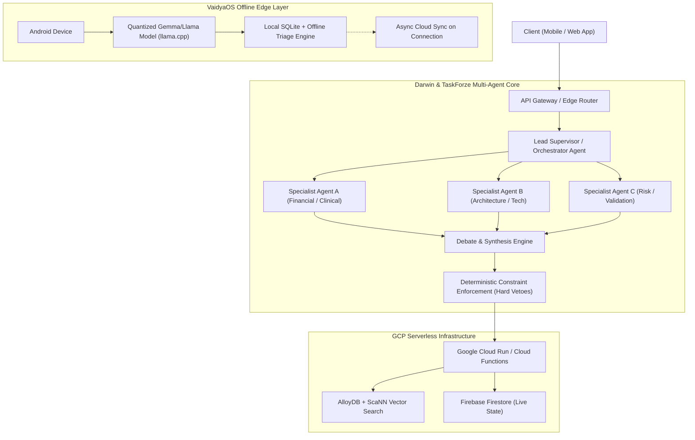
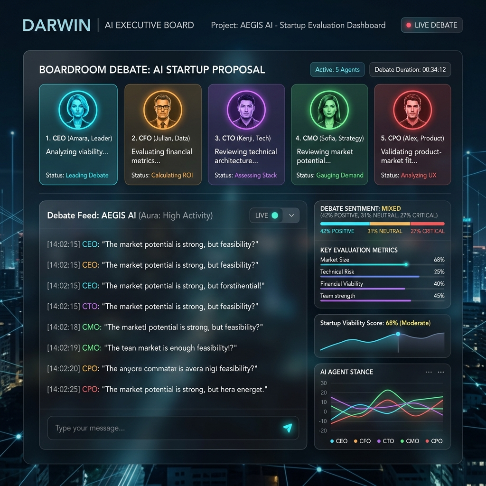

<div align="center">

<!-- Hero Banner -->


<!-- Animated Typing Subtitle -->
<a href="https://git.io/typing-svg">
  
</a>

<br/><br/>

<!-- Impact Metric Badges -->
<table>
<tr>
<td align="center" width="20%">
<br/>
<b>Competed</b>
</td>
<td align="center" width="20%">
<br/>
<b>Top Honours</b>
</td>
<td align="center" width="20%">
<br/>
<b>Top 1% Skills</b>
</td>
<td align="center" width="20%">
<br/>
<b>Shipped</b>
</td>
<td align="center" width="20%">
<br/>
<b>Verified Credentials</b>
</td>
</tr>
</table>

<br/>

<!-- Unified Links -->
<p>
  <a href="https://balaraj.me"></a>
  <a href="https://balaraj.me/blogs"></a>
  <a href="https://www.linkedin.com/in/balaraj-r-209a67330"></a>
  <a href="mailto:balarajr483@gmail.com"></a>
</p>
<p>
  <a href="https://www.skills.google/public_profiles/7e29917e-8bd6-41e6-8149-0795ae63c97b"></a>
  <a href="https://huggingface.co/balarajr"></a>
  <a href="https://www.kaggle.com/balarajr"></a>
  <a href="https://x.com/Balaraj__r"></a>
</p>
<p>
  
  
  
</p>

<!-- Agent Pipeline SVG -->
<p align="center">
  
</p>

</div>

---

## 👨‍💻 Engineering Identity

```python
class BalarajR:
    role       = "AI/ML Engineer | Edge AI Specialist | Distributed Systems Builder"
    location   = "Bengaluru, Karnataka, India 🇮🇳"
    education  = "PES University — B.Tech CSE (AI & ML), 2024–2028"
    portfolio  = "https://balaraj.me"
    contact    = "balarajr483@gmail.com"

    core_domains = [
        "Edge AI — Quantized on-device LLM inference (Gemma, Llama.cpp, GGUF)",
        "Agentic Swarms & Multi-Agent Orchestration (LangGraph, Google ADK, Genkit)",
        "Healthcare AI — Offline-first clinical triage & HIPAA-ready architectures",
        "Agritech AI — Satellite earth intelligence (Sentinel-2) + Multimodal vision",
        "Event-Driven Cloud Microservices (GCP Cloud Run, Functions, AlloyDB, Firebase)",
    ]

    flagship_systems = {
        "Darwin"     : "Multi-agent AI executive board running 3-round adversarial debates",
        "VaidyaOS"   : "Edge AI clinical OS running quantized LLMs on offline Android devices",
        "CareerLens" : "32-microservice AI career mapping platform — Google Gen AI National Winner 🏆",
        "AgriSence"  : "Precision agriculture OS serving 140M smallholder farmers — Inferentia Winner 🥇",
        "TaskForze"  : "Autonomous multi-agent swarm orchestration with dynamic self-healing loops",
    }
```

---

## 📰 Latest Articles from balaraj.me/blogs
<!-- BLOG-POST-LIST:START -->
- [AgriSence: The AI Operating System for India's 140M Smallholder Farmers](https://balaraj.me/blogs/agrisence-ai-agricultural-operating-system)
- [Building Darwin: The AI Executive Board for Startup Founders](https://balaraj.me/blogs/building-darwin-ai-executive-board)
- [Building VaidyaOS: Offline Healthcare AI Using Edge AI & GGUF](https://balaraj.me/blogs/building-vaidyaos-offline-healthcare-ai-edge-ai)
- [TaskForze: Autonomous Agent Swarm Orchestration with Dynamic Replanning](https://balaraj.me/blogs/taskforze-autonomous-agent-swarm-orchestration)
- [Scaling AI with Event-Driven Microservices: Lessons from 32 Services](https://balaraj.me/blogs/event-driven-microservices-ai)
<!-- BLOG-POST-LIST:END -->

> 📡 *Updated automatically every 12 hours via GitHub Actions from [`balaraj.me/rss.xml`](https://balaraj.me/rss.xml)*

---

## 🏛️ System Architecture Highlights



---

## 🏆 Honours & Recognitions

<div align="center">

| 🥇 Award | 🏛️ Organiser | 📅 Date |
|---|---|---|
| 🏆 **National Winner** — Google Gen AI Exchange Hackathon | Google Cloud × Hack2skill | 2025 |
| 🥇 **1st Place** — Inferentia 2.0 State Hackathon | PES University · AURA · AI&ML Dept | Sep 2025 |
| 🌟 **Google APAC Finalist** — Gen AI Academy APAC | Google Cloud × Hack2skill | 2026 |
| 🚀 **Round 1 Finalist** — Meta PyTorch OpenEnv Hackathon | Meta × OpenEnv × Scaler | Apr 2026 |
| 🛡️ **AMD Slingshot Hackathon** — CyberShield AI | AMD | 2025 |

</div>

---

## 🚀 Flagship Systems & Deep Dives

### 🤖 Darwin — The AI Executive Board for Founders
<div align="center">

[](https://github.com/balaraj74/darwin)
[](https://balaraj.me/projects/darwin)
[](https://balaraj.me/blogs/building-darwin-ai-executive-board)
[](https://darwin-5dleehg6la-el.a.run.app)


<br/>


</div>

**Problem**: Generic startup advice fails solo founders. They need an execution plan constrained by their actual technical skills, capital, and risk tolerance.

Darwin is a full-stack AI platform that acts as an **AI-powered executive board**. It builds a "Digital Twin" of the founder's constraints, then runs a 3-round debate among 5 specialized AI agents (CEO, CFO, CTO, CMO, CPO) to synthesize a final PROCEED/PIVOT/REJECT verdict with an execution blueprint.

* **Architecture Deep Dive:** Read on [balaraj.me/blogs/building-darwin-ai-executive-board](https://balaraj.me/blogs/building-darwin-ai-executive-board).
* **Interactive Case Study:** Read on [balaraj.me/projects/darwin](https://balaraj.me/projects/darwin).

---

### 🩺 VaidyaOS — Edge AI Healthcare Operating System
<div align="center">

[](https://github.com/balaraj74/VaidyaOS)
[](https://balaraj.me/projects/vaidyos)
[](https://balaraj.me/blogs/building-vaidyaos-offline-healthcare-ai-edge-ai)
[](https://roaring-valkyrie-042963.netlify.app/VaidyaOS.apk)


<br/>


</div>

**Problem**: 65% of India's rural population lacks access to qualified doctors. Internet connectivity is intermittent. Clinical AI must work *without* the cloud.

VaidyaOS is an offline-first Edge AI operating system for healthcare accessibility. It runs quantized LLMs directly on Android devices — enabling clinical triage, symptom analysis, and multilingual medical guidance with zero internet dependency.

* **Architecture Deep Dive:** Read on [balaraj.me/blogs/building-vaidyaos-offline-healthcare-ai-edge-ai](https://balaraj.me/blogs/building-vaidyaos-offline-healthcare-ai-edge-ai).
* **Interactive Case Study:** Read on [balaraj.me/projects/vaidyos](https://balaraj.me/projects/vaidyos).

---

### 🌾 AgriSence — AI Operating System for Smallholder Farmers
<div align="center">

[](https://github.com/balaraj74/AgriSence)
[](https://balaraj.me/projects/agrisence)
[](https://balaraj.me/blogs/agrisence-ai-agricultural-operating-system)
[](https://agrisence--agrisence-1dc30.us-central1.hosted.app/)
[](https://agrisence--agrisence-1dc30.us-central1.hosted.app/)


<br/>


</div>

**Problem**: Indian farmers lose 20–40% of crops annually to preventable diseases and poor advisory access. Agronomic advice is expensive, English-only, and internet-dependent.

AgriSence combines multimodal Gemini vision, satellite earth intelligence (Sentinel-2 and Landsat), and regional voice AI across 7 Indian languages to serve 140 million smallholder farming households.

* **Architecture Deep Dive:** Read on [balaraj.me/blogs/agrisence-ai-agricultural-operating-system](https://balaraj.me/blogs/agrisence-ai-agricultural-operating-system).
* **Interactive Case Study:** Read on [balaraj.me/projects/agrisence](https://balaraj.me/projects/agrisence).

---

### 🎯 CareerLens — AI Career Intelligence Platform
<div align="center">

[](https://github.com/balaraj74/careerlens)
[](https://balaraj.me/projects/career-lens)
[](https://careerlens--careerlens-1.us-central1.hosted.app)
[](https://careerlens--careerlens-1.us-central1.hosted.app)


<br/>


</div>

* **Architecture Deep Dive:** Read on [balaraj.me/blogs/event-driven-microservices-ai](https://balaraj.me/blogs/event-driven-microservices-ai).
* **Interactive Case Study:** Read on [balaraj.me/projects/career-lens](https://balaraj.me/projects/career-lens).

---

### ⚡ TaskForze — Autonomous Agent Swarm Orchestration
<div align="center">

[](https://github.com/balaraj74/taskforze)
[](https://balaraj.me/projects/taskforze)
[](https://balaraj.me/blogs/taskforze-autonomous-agent-swarm-orchestration)
[](https://github.com/balaraj74/taskforze)


<br/>


</div>

* **Architecture Deep Dive:** Read on [balaraj.me/blogs/taskforze-autonomous-agent-swarm-orchestration](https://balaraj.me/blogs/taskforze-autonomous-agent-swarm-orchestration).
* **Interactive Case Study:** Read on [balaraj.me/projects/taskforze](https://balaraj.me/projects/taskforze).

---

## 🎖️ Google Cloud Skills Verification (Gold League)

Balaraj is ranked in **Google Cloud Skills Gold League (6,527 points)**. Verified badges include:
- 🛡️ **AI & Enterprise Data:** *Build AI Agents with Enterprise Databases* • *Prompt Design in Vertex AI* • *Prepare Data for ML APIs* • *Streaming Analytics into BigQuery*
- ☁️ **Serverless & Kubernetes:** *Serverless on Cloud Run* • *Cloud Run Functions (3 Ways)* • *Manage Kubernetes in Google Cloud (GKE)* • *Develop Serverless Apps with Firebase*
- 🔐 **Security & Infrastructure:** *Build a Secure Google Cloud Network* • *Implement Sensitive Data Protection* • *Create a Secure Data Lake*
- 📜 **Official Transcript:** [View Verified Transcript on Google Skills](https://www.skills.google/public_profiles/7e29917e-8bd6-41e6-8149-0795ae63c97b)

---

## 📊 GitHub Contribution & Streak Analytics

<div align="center">


</div>

---

<div align="center">

## 📫 Let's Build Something Together

<table>
<tr>
<td align="center">
  <a href="https://balaraj.me">
    
  </a>
</td>
<td align="center">
  <a href="https://balaraj.me/blogs">
    
  </a>
</td>
<td align="center">
  <a href="mailto:balarajr483@gmail.com">
    
  </a>
</td>
</tr>
<tr>
<td align="center">
  <a href="https://www.linkedin.com/in/balaraj-r-209a67330">
    
  </a>
</td>
<td align="center">
  <a href="https://www.skills.google/public_profiles/7e29917e-8bd6-41e6-8149-0795ae63c97b">
    
  </a>
</td>
<td align="center">
  <a href="https://x.com/Balaraj__r">
    
  </a>
</td>
</tr>
</table>

<br/>


*"Build AI systems that support humans in critical decision-making — safely, transparently, and responsibly."*

**— Balaraj R &nbsp;|&nbsp; [balaraj.me](https://balaraj.me) &nbsp;|&nbsp; Open to Collaborations 🤝**

</div>
